# butter_task

A simple crossplatform task manager written in flutter.

### Features
- add new task
- remove an existent task
- persistance layer to store all your tasks in a sqlite db

### Screens
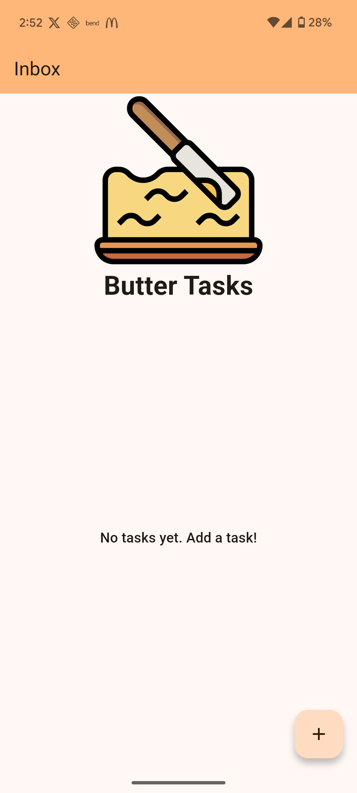
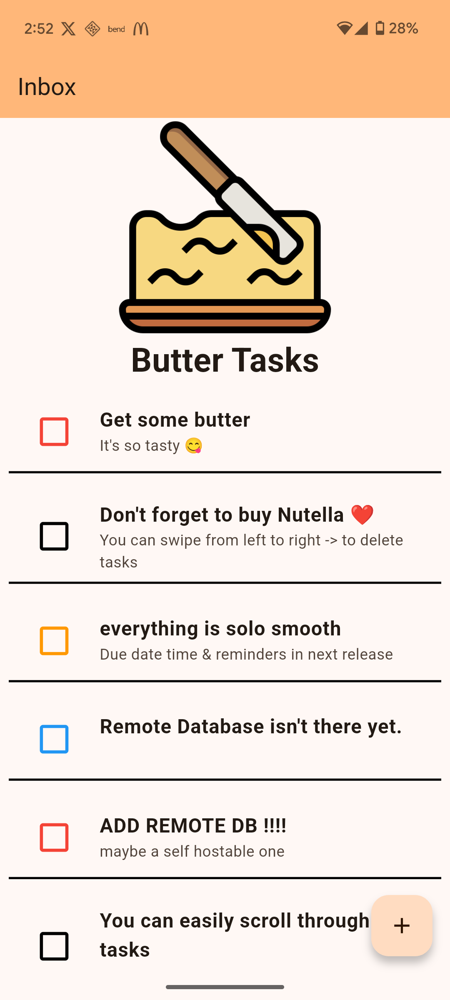
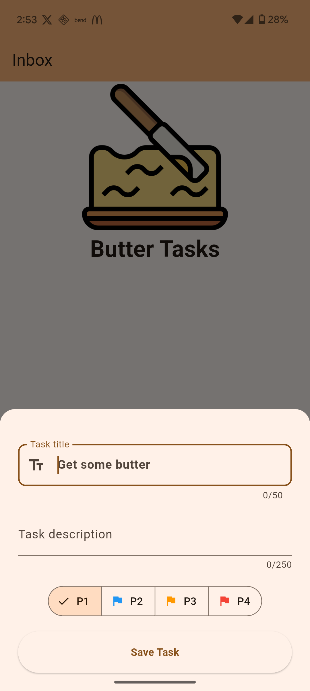
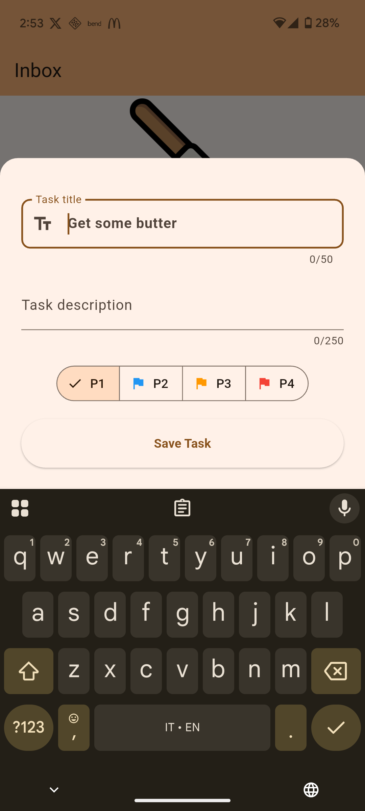
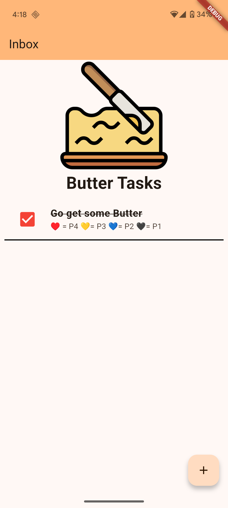
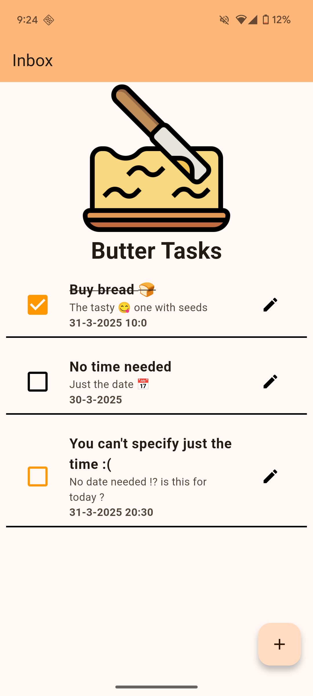
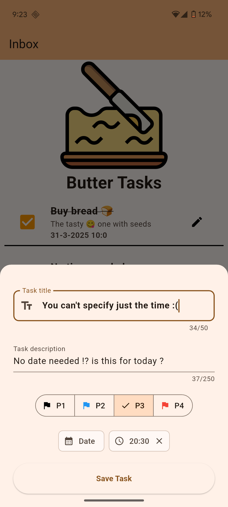
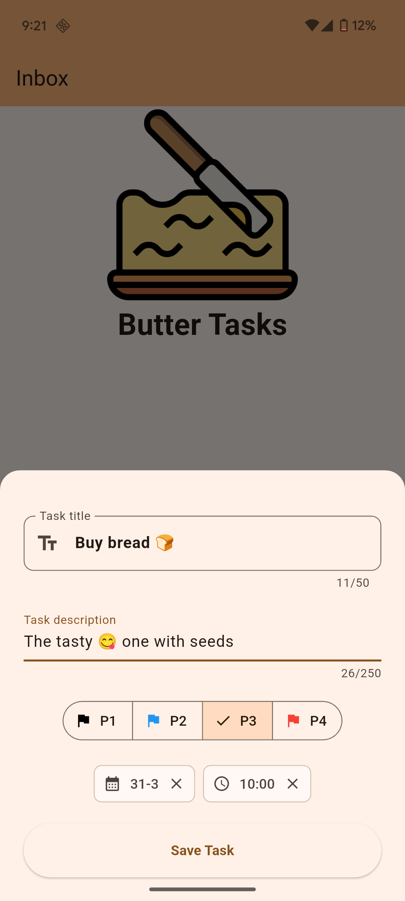
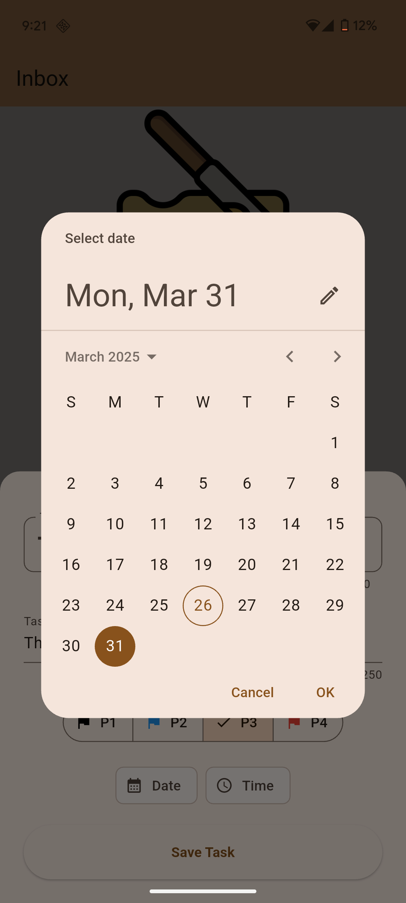
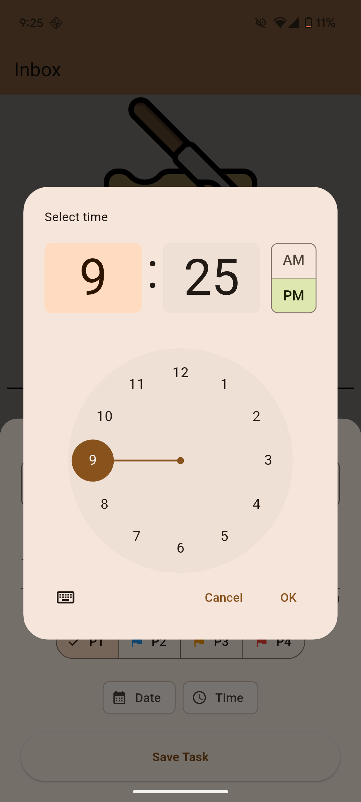

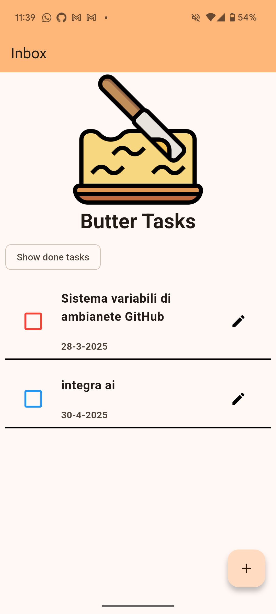
